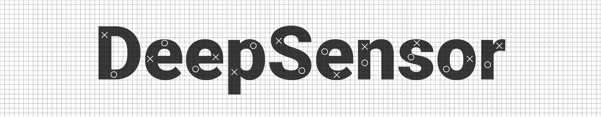

[//]: # (![]&#40;figs/DeepSensorLogo.png&#41;)
<ul style="text-align: center;">

</ul>

<ul style="margin-top:0px;">


<p style="text-align: center; font-size: 15px">A Python package and open-source project for modelling environmental
data with neural processes</p>

-----------

[](https://github.com/tom-andersson/deepsensor/releases)

[](https://coveralls.io/github/tom-andersson/deepsensor?branch=main)
[](https://github.com/psf/black)
[](https://github.com/tom-andersson/deepsensor/blob/main/LICENSE)

**NOTE**: This package is a work in progress and breaking changes are likely. If you are interested
in using DeepSensor, please get in touch first (tomand@bas.ac.uk).

For demonstrators, use cases, and videos showcasing the functionality of DeepSensor, check out the
[DeepSensor Gallery](https://github.com/tom-andersson/deepsensor_gallery)!

Why neural processes?
-----------
NPs are a highly flexible class of probabilistic models that can:
- ingest multiple context sets (i.e. data streams) containing gridded or pointwise observations
- handle multiple gridded resolutions
- predict at arbitrary target locations
- quantify prediction uncertainty

These capabilities make NPs well suited to modelling spatio-temporal data, such as
satellite observations, climate model output, and in-situ measurements.
NPs have been used for range of environmental applications, including:
- downscaling (i.e. super-resolution)
- forecasting
- infilling missing satellite data
- sensor placement

Why DeepSensor?
-----------
DeepSensor aims to faithfully match the flexibility of NPs with a simple and intuitive
interface.
DeepSensor wraps around the powerful [neuralprocessess](https://github.com/wesselb/neuralprocesses)
package for the core modelling functionality, while allowing users to stay in
the familiar [xarray](https://xarray.pydata.org) and [pandas](https://pandas.pydata.org) world
and avoid the murky depths of tensors!

Deep learning library agnosticism
-----------
DeepSensor leverages the [backends](https://github.com/wesselb/lab) package to be compatible with
either [PyTorch](https://pytorch.org/) or [TensorFlow](https://www.tensorflow.org/).
Simply `import deepsensor.torch` or `import deepsensor.tensorflow` to choose between them!

Quick start
----------

Here we will demonstrate a simple example of training a convolutional conditional neural process
(ConvCNP) to spatially interpolate ERA5 data.
First, pip install the package. In this case we will use the PyTorch backend.
```bash
pip install deepsensor
pip install torch
```

We can go from imports to predictions with a trained model in less than 30 lines of code!

```python
import deepsensor.torch
from deepsensor.data.processor import DataProcessor
from deepsensor.data.loader import TaskLoader
from deepsensor.model.convnp import ConvNP
from deepsensor.train.train import train_epoch

import xarray as xr
import pandas as pd
import numpy as np

# Load raw data
ds_raw = xr.tutorial.open_dataset("air_temperature")

# Normalise data
data_processor = DataProcessor(x1_name="lat", x1_map=(15, 75), x2_name="lon", x2_map=(200, 330))
ds = data_processor(ds_raw)

# Set up task loader
task_loader = TaskLoader(context=ds, target=ds)

# Set up model
model = ConvNP(data_processor, task_loader)

# Generate training tasks with up to 10% of grid cells passed as context and all grid cells
# passed as targets
train_tasks = []
for date in pd.date_range("2013-01-01", "2014-11-30")[::7]:
    task = task_loader(date, context_sampling=np.random.uniform(0.0, 0.1), target_sampling="all")
    train_tasks.append(task)

# Train model
for epoch in range(10):
    train_epoch(model, train_tasks, progress_bar=True)

# Predict on new task with 10% of context data and a dense grid of target points
test_task = task_loader("2014-12-31", 0.1)
mean_ds, std_ds = model.predict(test_task, X_t=ds_raw)
```

After training, the model can predict directly to `xarray` in your data's original units and coordinate system:
```python
>>> mean_ds
<xarray.Dataset>
Dimensions:  (time: 1, lat: 25, lon: 53)
Coordinates:
  * time     (time) datetime64[ns] 2014-12-31
  * lat      (lat) float32 75.0 72.5 70.0 67.5 65.0 ... 25.0 22.5 20.0 17.5 15.0
  * lon      (lon) float32 200.0 202.5 205.0 207.5 ... 322.5 325.0 327.5 330.0
Data variables:
    air      (time, lat, lon) float32 246.7 244.4 245.5 ... 290.2 289.8 289.4
```

We can also predict directly to `pandas` containing a timeseries of predictions at off-grid locations
by passing a `numpy` array of target locations to the `X_t` argument of `.predict`:
```python
# Predict at two off-grid locations for three days in December 2014
test_tasks = task_loader(pd.date_range("2014-12-01", "2014-12-31"), 0.1)
mean_df, std_df = model.predict(test_tasks, X_t=np.array([[50, 280], [40, 250]]).T)
```

```python
>>> mean_df
                              air
time       lat  lon              
2014-12-01 50.0 280.0  260.183056
           40.0 250.0  277.947373
2014-12-02 50.0 280.0   261.08943
           40.0 250.0  278.219599
2014-12-03 50.0 280.0  257.128185
           40.0 250.0  278.444229
```

This quickstart example is also available as a [Jupyter notebook](https://github.com/tom-andersson/deepsensor_demos/blob/main/demonstrators/quickstart.ipynb) with added visualisations.

Extending DeepSensor with new models
----------
To extend DeepSensor with a new model, simply create a new class that inherits from `deepsensor.model.DeepSensorModel`
and implement the low-level prediction methods defined in `deepsensor.model.ProbabilisticModel`,
such as `.mean` and `.stddev`.
```python
class NewModel(DeepSensorModel):
    """A very naive model that predicts the mean of the first context set with a fixed stddev"""
    def __init__(self, data_processor: DataProcessor, task_loader: TaskLoader):
        super().__init__(data_processor, task_loader)
        
    def mean(self, task: Task):
        """Compute mean at target locations"""
        return np.mean(task["Y_c"][0])
    
    def stddev(self, task: Task):
        """Compute stddev at target locations"""
        return 0.1
    
    ...
```
`NewModel` can then be used in the same way as the built-in `ConvNP` model.
See [this Jupyter notebook](https://github.com/tom-andersson/deepsensor_gallery/blob/main/demonstrators/extending_models.ipynb)
for more details.


## Citing DeepSensor
If you use DeepSensor in your research, please consider citing this repository.
You can generate a BiBTeX entry by clicking the 'Cite this repository' button
on the top right of this page.

## Acknowledgements
DeepSensor is funded by [The Alan Turing Institute](https://www.turing.ac.uk/).
