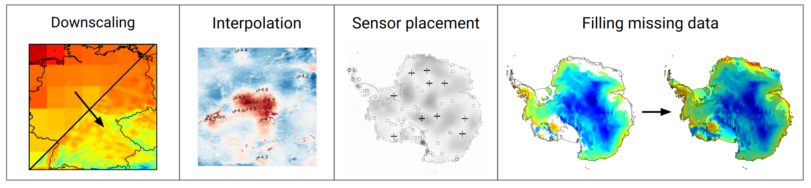

# Overview: Why DeepSensor?

Machine learning (ML) has made its way from the fringes to the frontiers of environmental science.
DeepSensor aims to accelerate the next generation of research in this growing field.
How? By making it easy and fun to apply advanced ML models to environmental data.

## Environmental data

Environmental data is challenging for conventional ML architectures because
it can be multi-modal, multi-resolution, and have missing data.
The various data modalities (e.g. in-situ weather stations, satellites, and simulators) each provide different kinds of information.
We need to move beyond vanilla CNNs, MLPs, and GPs if we want to fuse these data streams.

## Neural processes

Neural processes have emerged as promising ML architectures for environmental data because they can:
* efficiently fuse multi-modal and multi-resolution data,
* handle missing observations,
* capture prediction uncertainty.

Early research has shown NPs are capable of tackling diverse spatiotemporal modelling tasks,
such as sensor placement, forecasting, downscaling, and satellite gap-filling.

## What DeepSensor does

The DeepSensor Python package streamlines the application of NPs
to environmental sciences by plugging together the `xarray`, `pandas`, and `neuralprocesses` packages with a user-friendly interface that enables rapid experimentation.
**All figures below visualise outputs from DeepSensor**:


```{warning}
NPs are not off-the-shelf ML models like those you might find in `scikit-learn`.
They are novel, data-hungry deep learning models.
Early studies have been very promising,
but more research is needed to understand when NPs work best and how to get the most out of them.
That's where the DeepSensor package and community come in!
```

## Project goals

DeepSensor aims to:
* Drastically reduce the effort required to apply NPs to environmental data so users can focus on the science
* Build an open-source software and research community
* Generate a positive feedback loop between research and software
* Stay updated with the latest SOTA models that align with the DeepSensor modelling paradigm

If this interests you, then let's get started!
