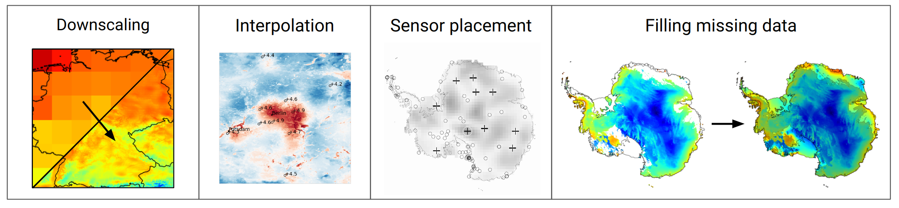

# Overview: Why DeepSensor?

Firstly, some background. Machine learning (ML) has made its way from the fringes to the
frontiers of environmental science. However, most of the success stories so far use gridded reanalysis data.
There are growing calls for ML approaches that can handle the challenges of environmental observations
to tackle a range of
prediction tasks like forecasting, downscaling, satellite gap-filling, and sensor placement (i.e.
telling us where to put sensors to get the most information about the environment).

Environmental data is challenging for conventional ML architectures because
as it can be multi-modal, multi-resolution, and have missing data.
Differing data modalities provide different information:
station data provides high quality localised information but may not represent surroundings;
satellite data provides huge areas of high-res information, but only indirectly sense target quantities and can have missing data;
reanalysis data provides convenient gridded state estimates of the atmosphere and oceans but are limited by model bias and coarse resolution.

The DeepSensor Python package streamlines the application of neural
processes (NPs) to environmental sciences, including sensor placement, forecasting, downscaling, and
satellite gap-filling. NPs are well-suited to environmental data: they can efficiently fuse
multi-modal and multi-resolution data, handle missing observations, and capture prediction
uncertainty. DeepSensor aims to bring this powerful modelling paradigm to practitioners by plugging
together the `xarray`, `pandas`, and `neuralprocesses` packages with a user-friendly interface that
enables rapid experimentation. Now, our developers and users form an open-source community whose
vision is to accelerate the next generation of environmental ML research. We are eager to grow
DeepSensor from a young Python package into a large and dedicated software community.

This package aims to faithfully match the flexibility of NPs with a simple and intuitive interface.
Under the hood, DeepSensor wraps around the
powerful [neuralprocessess](https://github.com/wesselb/neuralprocesses) package for core modelling
functionality, while allowing users to stay in the familiar [xarray](https://xarray.pydata.org)
and [pandas](https://pandas.pydata.org) world from end-to-end.
DeepSensor also provides convenient plotting tools and active learning functionality for finding
optimal [sensor placements](https://doi.org/10.1017/eds.2023.22).
