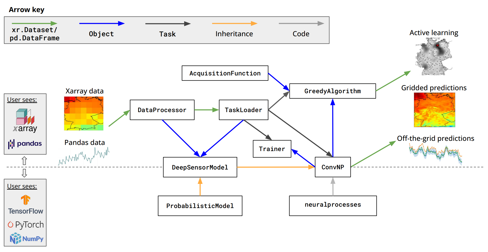

# DeepSensor design

Some users will find it useful to understand the design of DeepSensor
before they begin. Others would prefer to just see some examples and
get started right away.

If you fall into the latter category,
feel free to jump straight to the next page ().

## Design overview

A schematic overview of the core components of DeepSensor is shown below. 
This shows how the package's components process data & interact from end-to-end.

The key classes are:
* `DataProcessor`: Maps `xarray` and `pandas` data from their native units
to a normalised and standardised format (and vice versa).
* `TaskLoader`: Slices and samples normalised `xarray` and `pandas` data to generate `Task` objects for
training and inference.
* `Task`: Container for context and target data. Subclass of `dict` with additional methods
for processing and summarising the data.
* `DeepSensorModel`: Base class for DeepSensor models, implementing a high-level `.predict`
method for predicting straight to `xarray`/`pandas` in original coordinates and units.
* `ConvNP`: Convolutional neural process (ConvNP) model class (subclass of `DeepSensorModel`). 
Uses the `neuralprocesses` library. This is currently the only model provided by DeepSensor.
* `Trainer`: Class for training on `Task` objects using backpropagation and the Adam optimiser.
* `AcquisitionFunction`: Base class for active learning acquisition functions.
* `GreedyAlgorithm`: Greedy search algorithm for active learning.

In addition, a [`deepsensor.plot`](../reference/plot.rst) module provides useful plotting functions for
visualising:
* `Task` context and target sets,
* ``DeepSensorModel`` predictions,
* ``ConvNP`` internals (encoding and feature maps),
* ``GreedyAlgorithm`` active learning outputs.

You will see examples of these `deepsensor.plot` visualisation functions
throughout the documentation.

## Design principles

A few key design principles have guided the development of DeepSensor:

* **User-friendly interface**: The interface should be simple and intuitive, with the flexibility to
handle a wide range of use cases.
* **Leverage powerful and ubiquitous data science libraries**: Users can stay within the familiar `xarray`/`pandas`
ecosystem from start to finish in their DeepSensor research workflows.
* **Infer sensible defaults**: DeepSensor should leverage information in the data to infer
sensible defaults for hyperparameters, with the option to override these defaults if desired.
* **Extensible**: Extend DeepSensor with new models by sub-classing `DeepSensorModel` and 
implementing the low-level prediction methods of `ProbabilisticModel`.
* **Modular**: The `DataProcessor` and `TaskLoader` classes can be used independently of
the downstream modelling and active learning components, and can thus be used outside of
a DeepSensor workflow.
* **Deep learning library agnostic**: DeepSensor is compatible with both
TensorFlow and PyTorch thanks to the [`backends`](https://github.com/wesselb/lab) library - simply `import deepsensor.tensorflow` or
`import deepsensor.torch`.
